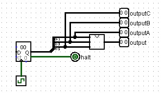

# Autograder example
This is an example of a grading script for simple combinational circuits. It should be used for testing the outputs for all possible inputs.

If the assignment requires loading data into a ROM and more closely reflects a sequential circuit, check out the other subfolder. Update: loading data into ROM seems not possible and into RAM seems buggy... see the [load-example directory]().

# Prerequisites
* The following should be clearly described in the lab instructions:
    + The number of data bits for inputs and outputs
    + The orientation of input and output (facing West/North/etc.)
    + The order of and the distance between the inputs and outputs (see [The inputs section](#the-inputs) below)

# How to use
<!-- You may find it useful to read the [Description of this example section](#description-of-this-example) first to understand the various files needed and how they're used. -->

## Script
The script was written and tested with Python 3.9.0 and is called `grader.py`.

It is used to test the correctness of the student work by using a Logisim file that tests all combinations of input. It generates an output file for each student which is then checked against the correct output to see if the contents completely match or not.

### Arguments and Defaults
It takes many arguments, but there are defaults set. If you would not like to enter them each time, then modify the variables set on top of the script. The arguments with defaults can be omitted on the command line.

These may be relative paths or full paths. Note that some of these require a path to a directory and some require a path to the file.

Here is the list of arguments:
* `-sd/--studir`: the path to the directory containing student folders
* `-ip/--interpath`: the intermediate path between studir directory and directory containing student work
    + e.g. if `-studir` is `/home/students/` and student X's work is in `/home/students/X/lab3/`, then `interpath` should be `lab3` (the student's name should be excluded)
* `-wn/--workname`: the file name of student's work
    + e.g. `vendingMachine.circ`
* `-jp/--jarpath`: the path to the Logisim jar file described in [Prerequisites](../README.md/#pre-requisites)
    + e.g. `../logisim.jar`
* `-cp/--checkerpath`: the path to the file used to generate all combinations of inputs and runs it through the student's work
* `-kp/--keypath`: the path to the correct circuit loaded as a library in the checker circuit (see [The correct circuit](#the-correct-circuit) below)
    + e.g. `./key.circ`
* `-od/--outputdir`: the path to the directory in which to save the correct and student output
    + e.g. `./stuOut/`
* `-rp/--reportpath`: the path to the report file (generated if doesn't exist, cleared out if it does).
    + e.g. `./report.txt`

## Creating a main tester / main checker
The main checker looks like follows:



A 6-bit counter is used to generate all possible combinations of the 2-bit inputs A, B, and C.

The inputs are then passed to the correct circuit (described below), which is a loaded library. It was loaded by `Projects` &rarr; `Load Library` &rarr; `Logisim Library...` and then selecting the circuit. After loading the circuit, it appears as a library on the pane, which can be dragged and dropped like other components. See [the inputs](#the-inputs) section for notes about the loaded libraries.

The checker requires a 1-bit `halt` output which ends the Java command testing for that circuit. In this case, `halt` is true when we have carry in the program; i.e. we've gone through all possible inputs.

## The correct circuit
This circuit is used to generate the correct output and serves as a reference point for substituting student's work. It should have the correct circuit with [the inputs](#the-inputs) in the correct order and distance.

## Example command line
An example command is shown below:
```
python3 grader.py --studir ./students -ip lab0 -cp ./main-tester -wn vending.circ
```

Some arguments were omitted because setting a default for them to be omitted.

# Description of this example

## The assignment
The fake assignment in this example is to create a circuit that takes in three 2-bit inputs (A, B, C) and output a two-bit result that corresponds to `AB$\neg$C + $\neg\ABC`.

## The files and folders
* `students` has various student folders in it.
    + This would be the `--studir` argument.
* Each student has a file called `LogicGate.circ` in a directory called `lab1` of their folder.
    + These would be the the `--workname` and the `--interpath` argument, respectively.
* `main-tester.circ` generates all possible inputs for `A`, `B`, and `C`. It has `correct-circuit` loaded into it.
    + These would be the `--checkerpath` and `--keypath` arguments, respectively.
* `stuOut` contains the correct output and the output of each student.
    + This is the `--outputpath` argument.
* `report.txt` is the report describing whether each student has an output that matches the  correct output.

### The inputs
While the inputs can be labelled whatever, the order of the inputs matter. Specifically, the order of the inputs in the [circuit appearance](http://www.cburch.com/logisim/docs/2.7/en/html/guide/subcirc/appear.html) is important.

They should be the same as how the `correct-circuit.circ` file is used in `main-tester.circ` file.

Changing the order of inputs in the appearance seems to make an impact, and can be shown by students H and I. The distance between inputs and the size might also matter (students J and K), but has not been extensively tested.

Therefore, it is generally recommended that students do not modify the main circuit's appearance and make sure the order of the inputs and the outputs are correct.

Note: the upper most input components are higher up in the circuit's appearance - if they are at the same vertical level in Logisim, then left most input components are higher up.

## TODO
I envision these changes are necessary
* Instructions about the order (e.g. `A` above `B`) and orientation (e.g. facing East) of the inputs and the outputs
* Files to include in the initial lab repository that includes a new script students could run to check whether they have the input order correct, etc.
* Partial credit rather than entire match in the output files.